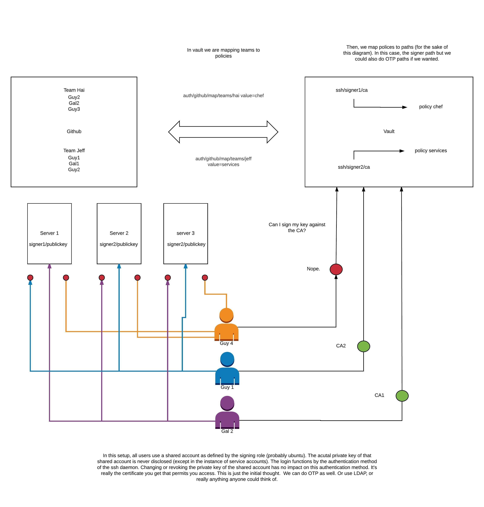

If you like the project, leave me a star!

# What is it?
It's vault and consul in a HA setup deployed via docker swarm. You can deploy any number of consul nodes and it will spin up vault on top of those. The data volumes are persistent via rexray. Vault uses consul as a storage backend.

# Brief Precursor
Architecturally (That is the deployment model, you need to tune confs), this thing is production ready. Programmatically, it's not bad, but it could use some tightening. It's all bash, so it's not like there's solid linters or formatters (that I'm aware of). That said, it's all bash so it's also not like it's going to become this massive codebase that's hard to read and maintain. Don't let it being bash fool you though, it's a very robust solution. At the end, I'll touch on use case and why you would use a solution like this vs something like chef.

# Prerequisites
It's not super required, but you may want to know a little about docker swarm OR consul/vault before you approach this system. It's simple, but it's complex in its simplicity. I don't know how else to put that. I wouldn't want to approach both systems cold.

First, you need the docker suite. This should cover it. This all is intended to run on Linux kernel 3.10+. You're looking at CentOS 7+ and Ubuntu 14.04+. This is only tested on Ubuntu, but it should be decently agnostic.   

```
command -v docker >/dev/null 2>&1 || { curl -s https://test.docker.com/ | bash; }
command -v pip >/dev/null 2>&1 || { \curl -L https://bootstrap.pypa.io/get-pip.py | python || \curl -L https://bootstrap.pypa.io/get-pip.py | python3; }
command -v docker-compose >/dev/null 2>&1 || { pip install docker-compose; }
command -v docker-machine >/dev/null 2>&1 || ( curl -L "https://github.com/docker/machine/releases/download/v0.13.0/docker-machine-`uname -s`-`uname -m`" > /tmp/docker-machine && \
chmod +x /tmp/docker-machine && \
sudo cp /tmp/docker-machine /usr/local/bin/docker-machine )
```
Where you've installed this will act as a provisioning node

# Workflow

There's a hooks directory. The objective here was to promote that infrastructure as code idea where you move from sandbox, development, staging and then to production. It expects branches to be named sb, dev, stg, pr. You can modify hooks as you'd like, or not use them at all. When you pull/commit it should set it up to prevent merge conflicts. Hooks can only be enforced locally. To use:
```
git config core.hooksPath hooks
```

The make.sh script is your master file. It handles the templatization of the repo based on the variables. I hate calling things self documenting, but the variable names line up pretty well with all of the respective AWS pieces. Plug in the right variables and then run the ./make.sh. Your whole deployment looks like this:

```
./make.sh
./bin/swarminit.bash
# once the script is done running, you're ready to deploy the service stack.
eval "$(docker-machine env YOURMANAGER1)" # what ever you named cluster docker-machine ls to check
docker stack deploy --compose-file stacks/stack.yaml consul-vault #this name is hardcoded if you want to use the migration scripts
#do your initial vault unseal and make sure everything is green in consul, then deploy the second stack
#You might want to go read the vault docs
docker exec -ti $(docker ps -a  | grep vault: | head -1 | cut -f1 -d" " ) /bin/sh
vault init
vault unseal; vault unseal; vault unseal
#back on your host
docker stack deploy --compose-file stacks/vaultHA.yaml vaultha
#There is a helper script "tmux.bash" that should terminal you into all of your instances provided you have tmux installed.
#The open source vault docs say that the unseal process is a manual one and this should streamline the process
bin/tmux.bash #first key always fails so it unseals 4 times. I think I get a weird char for what ever reason. I didn't dig too much yet.
```

# Advanced usages
So a lot of this later stuff was WIP. I just didn't get enough buy in so it never went to prod. Beyond spinning up servers and deploying a stack, the rest of this is experimental. createlb.bash will do just that, create an lb. It's idempotent and won't hurt anything to run it multiple times.

The migration scripts prep and post are meant to facilitate a blue/green deployment model. Prep will move all your machines to the "old" designation and modify hostnames. You can then redeploy using swarminit.bash after running another make. You should now have an identical swarm that IS NOT connected to the original swarm. You will run your consul and vault deploys again. Once you show green across the board (you should have doubled all your services at this point). Then run post and it will spin down the old services.

lb was in pretty good shape, the migration process was ok.

# Why you would use this instead of Chef or some other deployment model
One, I really like the orchestration model of containers. Define a concept for infrastructure and let that exist dynamically (at least as possible, if you need a pillar for the rest of your infrastructure it has to be at least somewhat defined).

Two, if you need a service that all other services are going to rely on, you need a 0 start deployment. If you used chef, well now you need DNS for the chef server, boot strapping, https certs, etc. You've now bypassed your seed service. Something like ansible or terraform may facilitate it decently well, but I like the init style capacity swarm provides for service keep alive and just the ease of containers is really nice.

# Disaster Recovery
There's more writing I can do, but I don't know that anyone will even use this. If you want to use it or have any questions on how you would recover, let me know (open a bug) and I can help you. I usually respond within a business day. A week at the latest.

I'll leave you with a small architecture diagram that I put together. This is how I was going to use vault as a CA to manage access to servers.



